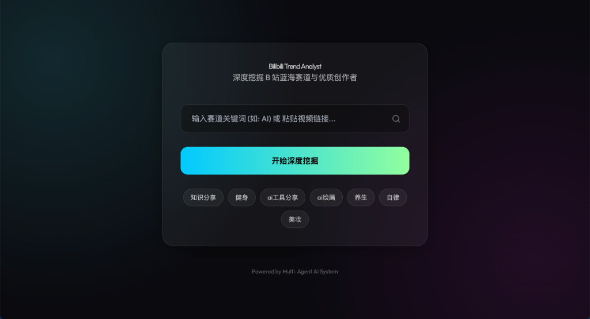
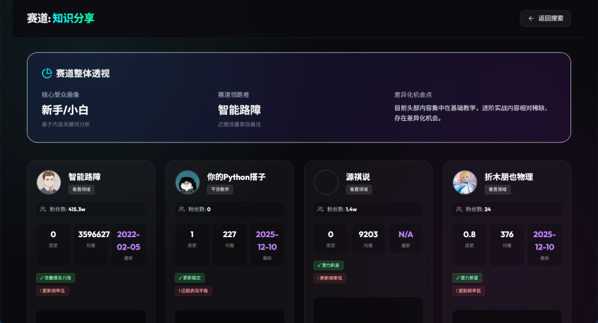
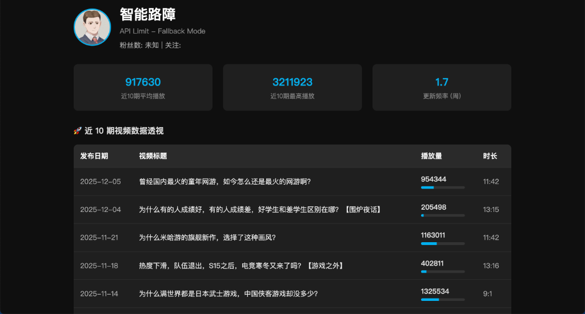

<div align="center">

# Bilibili Trend Analyst

**Unlock the Power of Bilibili Data | Deep Insight into Trends & Creators**

[](https://www.python.org/)
[](https://fastapi.tiangolo.com/)
[](LICENSE)

[中文文档](README_CN.md) | **English**

</div>

---

## 🚀 Overview

**Bilibili Trend Analyst** is a next-generation analytics tool tailored for content creators and marketers. It bypasses complex anti-scraping mechanisms to deliver real-time insights into Bilibili trends, creator performance, and audience engagement.

Whether you are tracking a rising niche or analyzing competitor strategies, this tool provides the data you need to stay ahead.

## ✨ Key Features

| Feature | Description |
| :--- | :--- |
| 🔍 **Smart Search** | Discover trending topics and identify high-potential niches with intelligent keyword matching. |
| 📊 **Deep Analytics** | Comprehensive breakdown of creator metrics: growth rate, weekly frequency, and engagement quality. |
| 🧠 **AI Insights** | **(Powered by AI)** Automatic content summarization and sentiment analysis of audience comments. |
| �️ **Robust Core** | Multi-layer fallback system (API -> Search -> Video) ensures data access even under heavy rate limiting. |
| 🎨 **Modern UI** | Sleek, dark-mode dashboard with Glassmorphism design for a premium user experience. |

## �️ Gallery

<div align="center">
  
  <br>
  <em>Smart Search & Trend Discovery</em>
  <br><br>
  
  
  <br>
  <em>Deep Track Analysis & Market Overview</em>
  <br><br>

  
  <br>
  <em>Detailed Creator Profiling & Video metrics</em>
</div>

## 🛠️ Tech Stack

- **Backend Framework**: [FastAPI](https://fastapi.tiangolo.com/) (High performance, easy to use)
- **Data Engine**: `Requests` with custom retry & fallback logic
- **Frontend**: HTML5 + [TailwindCSS](https://tailwindcss.com/) + Jinja2 Templates
- **Design System**: Custom Neon-Dark Theme

## ⚡ Quick Start

### 1. Clone & Install
```bash
git clone https://github.com/your-repo/bilibili-trend-analyst.git
cd bilibili-trend-analyst
pip install -r requirements.txt
```

### 2. Configure Environment
Copy the example config and add your Bilibili Cookie (SESSDATA) for full access:
```bash
cp .env.example .env
# Edit .env and paste your SESSDATA
```

### 3. Launch
```bash
python web_app.py
```
> Server running at: [http://127.0.0.1:8000](http://127.0.0.1:8000)

## 📄 License

This project is open-source and licensed under the [MIT License](LICENSE).

<div align="center">
  <sub>Built with ❤️ by Multi-Agent AI System</sub>
</div>
